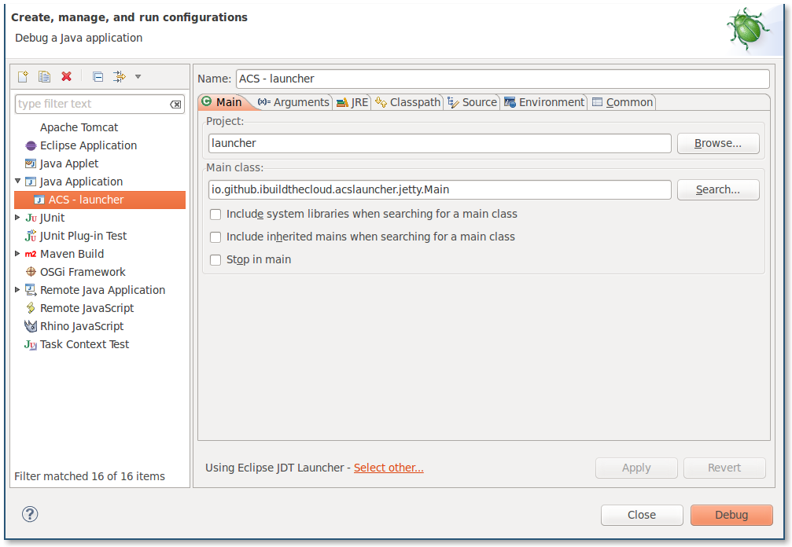

ACS Launcher for the impatient
==============================

This only works on Linux/OSX because this project includes symlinks.

Setup
=====

You need to symlink your ACS directory to a folder named "cloudstack" in the
root.  For example.

    git clone https://git-wip-us.apache.org/repos/asf/cloudstack.git
    git clone https://github.com/ibuildthecloud/acslauncher.git
    cd acslauncher
    ln -s ../cloudstack cloudstack

Now import the `launcher/` project and all the ACS projects as
"Existing Maven Projects" in Eclipse.  Setup a launch configuration with
`io.github.ibuildthecloud.acslauncher.jetty.Main` as your main class and
hopefully things work.  It should look like below.

Refer to [my-dev-env.md](my-dev-env.md) for more info on how I setup my dev environment
for ACS.
