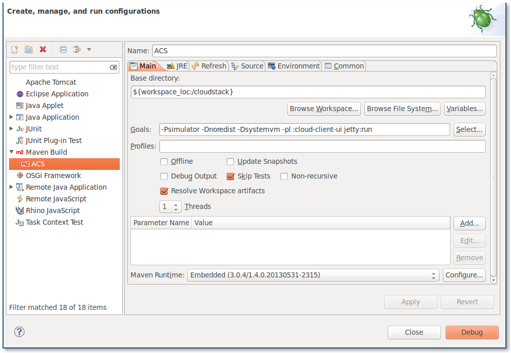
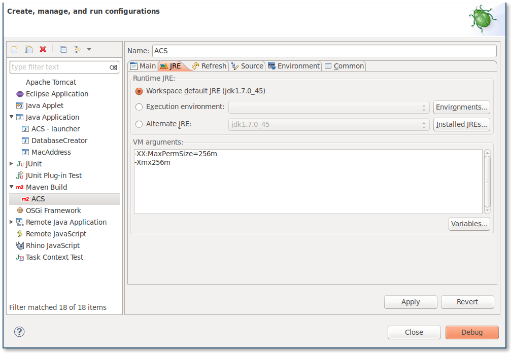

My Development Environment
==========================

I run Apache CloudStack in Ubuntu on a MacBook Pro MC975LL/A MacBookPro10,1
with 8GB of RAM.

Initial Setup
-------------

Clone ACS repo.

    git clone https://git-wip-us.apache.org/repos/asf/cloudstack.git

Once cloned I run the following maven commands to get everything initially
setup.  If the below commands fail, then obviously nothing will work in
Eclipse either so make sure the below commands run successfully.

    mvn -Pdeveloper -Dsystemvm -Dsimulator clean install
    mvn -Pdeveloper -pl developer -Ddeploydb
    mvn -Pdeveloper -pl developer -Ddeploydb-simulator

The above commands on my machine take about 6-10 minutes to run.

Setup Eclipse
-------------

I currently run Eclipse Kepler with the "Spring IDE Core" plugin from the
following [Update Site](http://dist.springsource.com/release/TOOLS/update/e4.2).
That is it.  I typically run with Oracle Java 7 because I like to use Java
Mission Control.

Once you have Eclipse running just do `File->Import, Existing Maven Projects`
then select the root of the ACS repo you cloned.  Eclipse should find over 100
projects, just import them all.

Let that build, it takes forever at first.  You may need to right click on a
project and do `Maven->Update Project` and select all projects and let it rebuild
everything.

Setup Jetty
-----------

I always launch Jetty from Eclipse.  To do this create a new launch configuration
at `Run->Debug Configurations...` and create a new `Maven Build` as follows



Here's the JRE settings I use too



When you first launch that maven build it may take a bit, but subsequent launches
run under a minute.  Jetty will start in almost exactly 45 seconds, but that doesn't
include the time it takes to start maven itself.  That adds less than 10 seconds.

Optimizing
==========

When ACS starts it loads a lot of plugins I typically don't care about.  So I disable
them.  I create `client/resources/modules.properties` with the below contents

```
modules.exclude=\
  baremetal-compute, \
  baremetal-discoverer, \
  baremetal-network, \
  baremetal-storage, \
  cisco-vnmc, \
  contrail, \
  elb, \
  f5, \
  hyperv-compute, \
  hyperv-discoverer, \
  ldap, \
  md5, \
  midonet, \
  netscaler, \
  nvp, \
  opendaylight, \
  ovm3-compute, \
  ovm3-discoverer, \
  ovm-compute, \
  ovm-discoverer, \
  ovs, \
  paloalto, \
  plaintext, \
  srx, \
  ssp, \
  storage-image-s3, \
  storage-image-swift, \
  storage-volume-cloudbyte, \
  storage-volume-solidfire, \
  vmware-discoverer, \
  vmware-compute, \
  vmware-network, \
  vmware-storage, \
  vns, \
  vxlan
```

This shaves about 10 seconds off my startup time.

Custom Launcher
---------------

I'm really impatient when it comes to starting ACS.  With the setup I've
mentioned so far it takes about 45 seconds to start Jetty.  A little less
than 10 seconds of that time is devoted to running maven and it really
adds no value for me.  So I wrote a custom launcher.  With my custom launcher
ACS will come up in about 35 seconds on my machine.  Refer to the
[README](README.md) for info on how to run my custom launcher.  Just know
that **this may void your warranty**.  No guarantee this will always work for
you.
